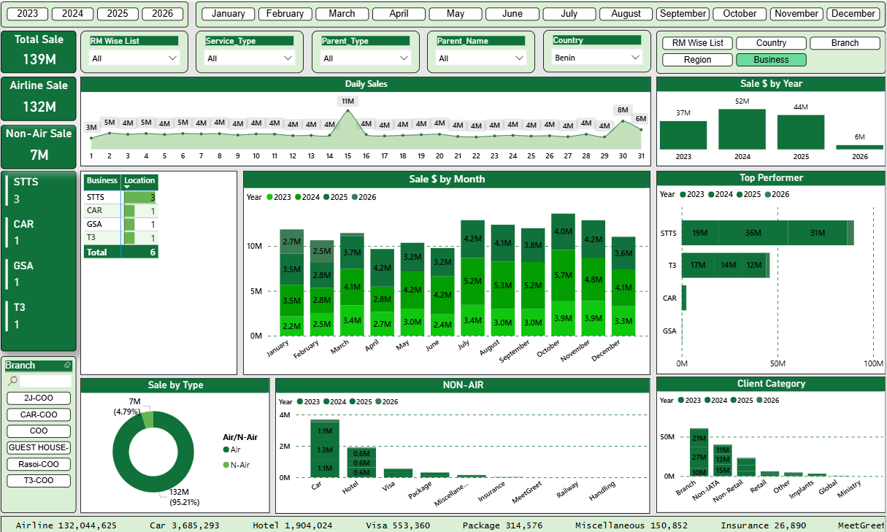
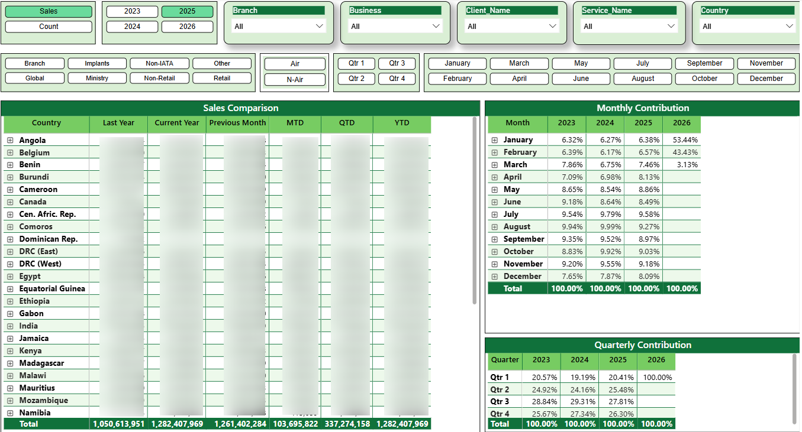
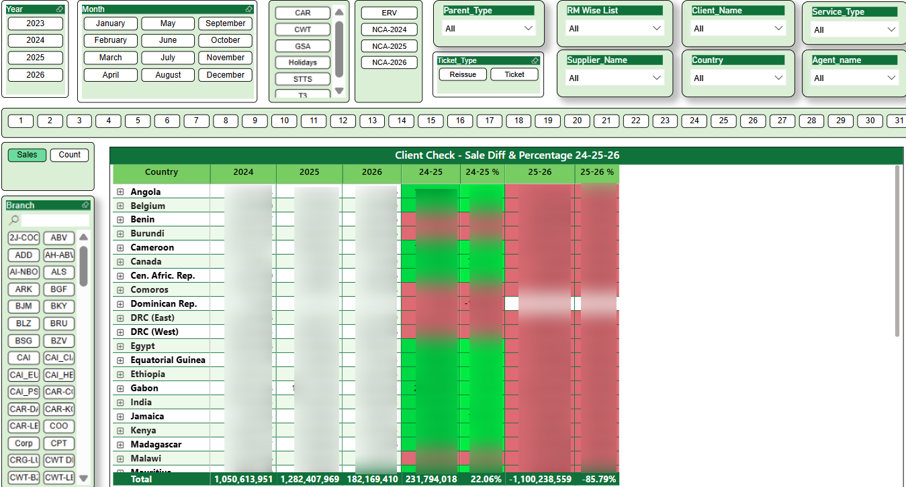
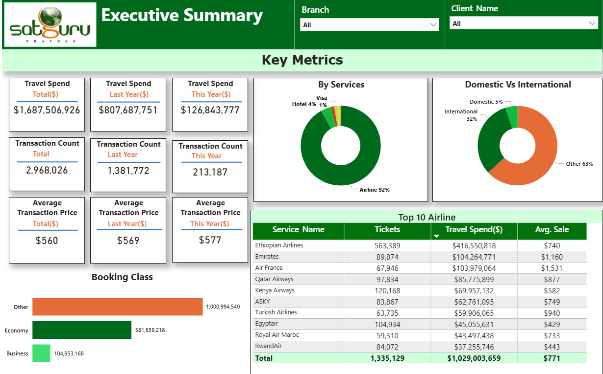
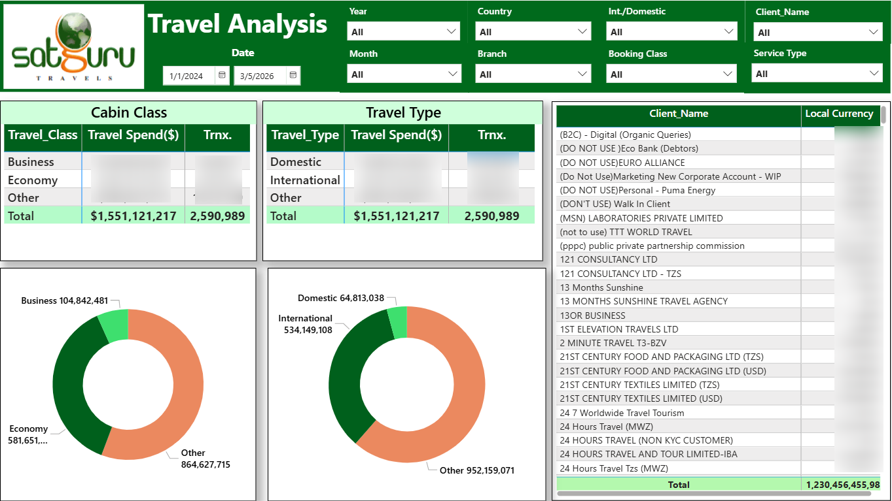
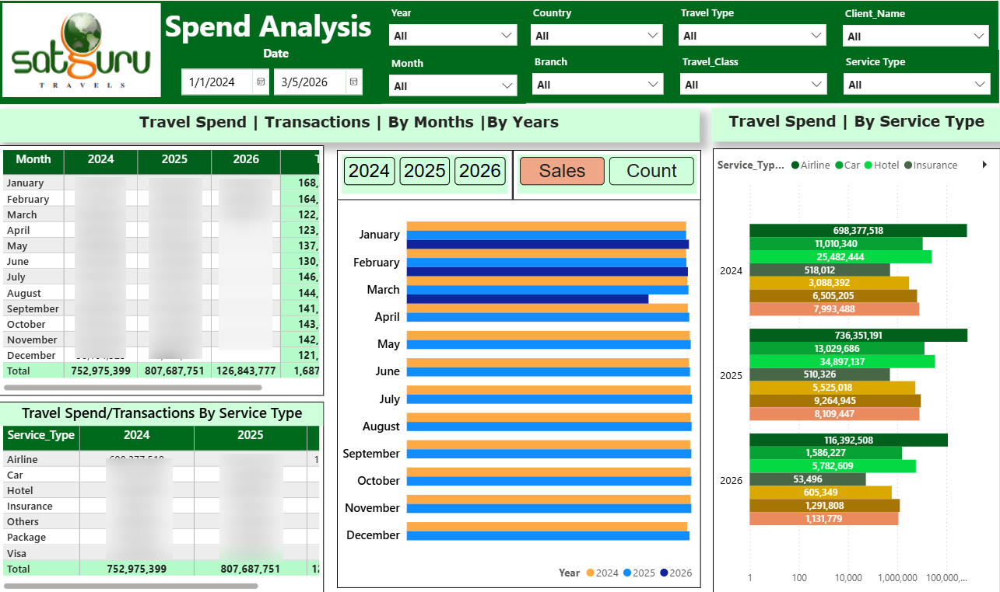
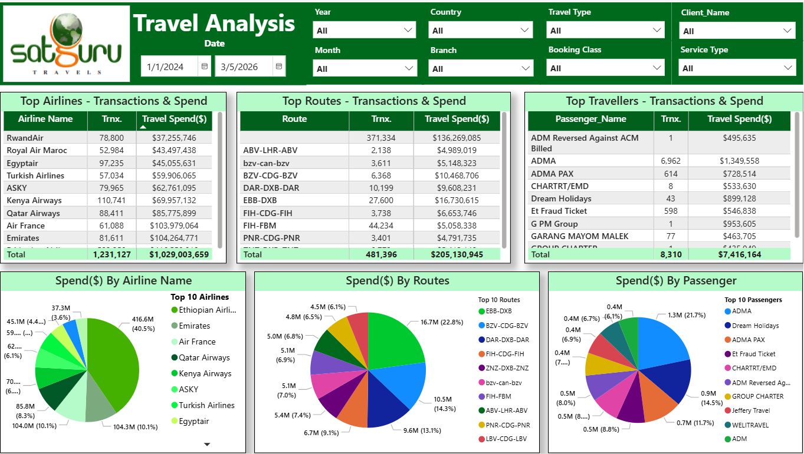

# 📊 Power BI Portfolio – Ravina Shevate

Data Analyst | Power BI Developer | SQL | DAX | Data Visualization  

Welcome to my Power BI portfolio repository.  
This repository showcases dashboards I developed to analyze business data, create KPI reports, and deliver actionable insights using Power BI.

---

# 🛠 Tools & Technologies

- Power BI
- SQL / MySQL / API's
- DAX
- Power Query
- Data Modeling
- Data Visualization

---

# 📈 Sales Performance Dashboard

## Business Problem
Businesses need clear insights into their sales performance to identify trends, compare growth across periods, and evaluate regional performance.

## Tools Used
Power BI, DAX, SQL,Postman

## Key Features
- KPI metrics (Total Sales, Profit, Growth)
- Sales trend analysis
- Year-over-Year comparison
- Interactive dashboard visuals

---

## Dashboard Overview

---

## Sales Trend Analysis

---

## Year-over-Year Difference

---

## Key Insights

- Identified overall sales trends over time
- Compared yearly sales performance
- Highlighted important KPIs for business monitoring

---

# 📊 Skills Demonstrated

- Business Intelligence Reporting
- KPI Dashboard Development
- Data Visualization
- DAX Calculations
- Data Analysis

---
# ✈️ Travel Spend Analysis Dashboard

## 🧩 Business Problem

Organizations often incur significant expenses related to employee travel such as flights, hotels, meals, and transportation. Without proper analysis, it becomes difficult to track spending patterns and control costs.

This dashboard helps stakeholders analyze travel expenses, monitor spending categories, and identify opportunities for cost optimization.

---

## ⚙️ Tools Used

- Power BI
- SQL
- DAX
- Power Query

---

## ⭐ Key Features

- Total Travel Spend KPI
- Category-wise spend analysis (Flights, Hotels, Meals, Transport)
- Department-wise travel expenses
- Monthly travel spend trend
- Interactive filters for deeper analysis

---

## 📊 Dashboard Overview

---

## 💰 Travel Breakdown

---

## 📈 Monthly Spend overveiw

## 📈 Monthly Travel-Spend Bifurcation

---

## 🔍 Key Insights

- Identified major cost contributors in travel expenses
- Analyzed monthly trends in travel spending
- Highlighted departments with the highest travel costs
- Provided insights for better travel budget planning

---

## 🧠 Skills Demonstrated

- Expense Data Analysis
- Dashboard Design
- KPI Development
- Data Visualization
- Business Insights Reporting
---
# 👩‍💻 About Me

I am a **Data Analyst and Power BI Developer with 3+ years of experience** in building interactive dashboards and automated reporting solutions.

I specialize in transforming complex datasets into meaningful insights using Power BI and SQL.

---

# 🔗 Connect With Me

LinkedIn:  
https://linkedin.com/in/ravina-shevate2008  

Location: Pune, India

---
